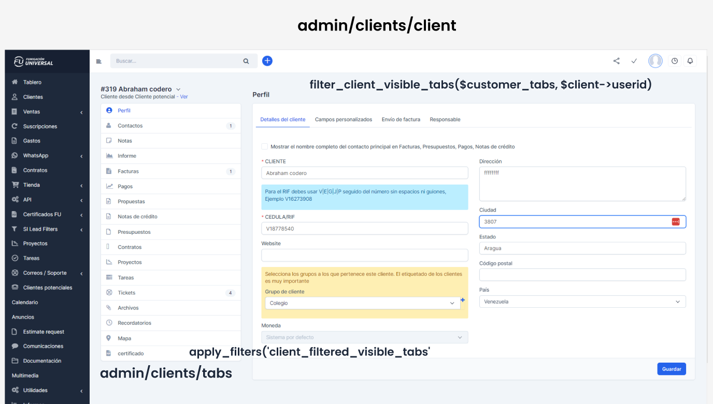

- Búsqueda de palabras clave en el código
- Búsqueda de archivos clave
- Búsqueda de funciones de bajo nivel
- Realizar una guía visual de hooks, variables, etc., y mostrar dónde se encuentran en las vistas
    
- Crear una representación visual de cómo se ven las variables; por ejemplo, mostrar la estructura del array de la variable $menu
- Cuando realice una búsqueda de variables, buscarlas sin el signo $ al principio, ya que PHP a veces crea las variables
- Comenzar por donde pueda obtener más retroalimentación
- Dejar la función más extensa para el final
- Centrarse en las variables clave, aquellas que afectan el comportamiento
- Estar atentos al ID de las cosas (aveces algo parecer ser una cosa, pero no es identico a otra por eso el id es unico) 